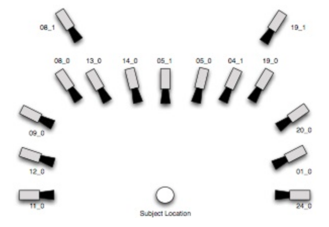

# obfuscate
In this project, we propose a novel pipeline that combines a face verification model with face augmentation methods for the task of one-shot face verification. The target application is face verification on event images to ensure privacy of visitors. The pipeline is tested for augmentations in pose, illumination and expression using the Multi-PIE and RaFD datasets. We show that our method can increase recall significantly, but that this is dependent on the quality of augmentations. We furthermore provide insight as to where and why the pipeline might fail. Using n-shot learning to recognize faces under various augmentations.

## MultiPIE filename structure

    <personID>_<sessionID>_<viewpoint>_<lighting>_<expression>_<pitch>_<yaw>_<roll>_<illumination_direction>_<illumination_intensity>_<glasses>.png
    
    PersonID:   The ID number of the person, between 001-346 (but there are be 337 in total...)
    sessionID:  Either 01, 02, 03 or 04
    viewpoint:  One out of ['051', '080', '140', '190', '041', '130', '050'], see image below for details
    lighting:   One out of ['02', '07', '12', '17']
                        '02': left side of face illuminated
                        '07': front side of face illuminated
                        '12': right side of face illuminated
                        '17': all sides of face illuminated
    expression: 0: neutral
                1: happy
    pitch:      Pitch (looking up/down) of the head added with postprocessing (augmented)
                Always of the form `p<angle>`, e.g., `p15` or `p-30`
                Angles include [-60, -45, -30, -15, 0, 15, 30, 45, 60]
    yaw:        Yaw (looking left/right) of the head added with postprocessing (augmented)
                Always of the form `y<angle>`, e.g. `y15` or `y-30`
                Angles include [-60, -45, -30, -15, 0, 15, 30, 45, 60]
    roll:       Roll of the head, currently always `r0`
    illumination_direction: Direction of the augmented illumination
                            Values are always preceded with `il`, e.g., `il0`, `il1`
                            Values: 0: no lighting change
                                    1: left lighting
                                    2: right lighting
                                    3: front lighting
    illumination_intensity: Intensity of the augmented illumination
                            Values are always preceded with `in`, e.g., `in0`, `in10`
                            Values: 0:  low intensity
                                    10: low intensity
                                    35: medium intensity
                                    60: clipping intensity
    glasses:                Boolean whether glasses are augmented or not (NOTE: target can have glasses when this
                            is set to 0, this _only_ indicates augmented glasses!)
                            Values: 0: no glasses augmented
                                    1: glasses augmented, type:  Gerret Light
                                                          color: Midnight Fox
                

    

## RaFD filename structure
Check RafD FAQ [here](http://www.socsci.ru.nl:8180/RaFD2/RaFD?p=faq)
The filenames code all image features in the following way, here as example 

_"Rafd090_28_Caucasian_male_angry_frontal.jpg"_:

VL2 = "000"  # -90 (right side visible)
VL1 = "045"  # -45 (right side visible)
VN  = "090"  # 0   (frontal view)
VR1 = "135"  # 45  (left side visible)
VR2 = "180"  # 90  (left side visible) 

| **value** | **explanation**            | **range**                                                                                 |
|-----------|----------------------------|-------------------------------------------------------------------------------------------|
| 090       | refers to the camera angle | ['000', '045', '090', '135', '180'], meaning (in degrees) respectively: [-90, -45, 0, 45, 90]                                                       |
| 28        | model number               | 1 to 73 (inclusive), except [34, 66, 6, 13, 17, 62]                                       |
| Caucasian | ethnicity of model         | ['Kid', 'Caucasian', 'Moroccan']                                                          |
| male      | gender of model            | ['female', 'male']                                                                        |
| angry     | emotion                    | ['happy', 'contemptuous', 'disgusted', 'fearful', 'neutral', 'angry', 'surprised', 'sad'] |
| frontal   | gaze direction             | ['right', 'frontal', 'left']                                                              |
